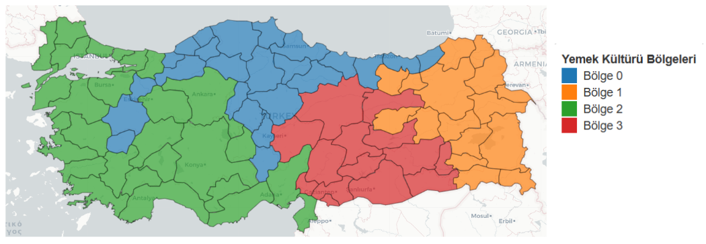

# 🇹🇷 Türkiye'nin Dijital Lezzet Haritası 🍲

## 📌 Proje Tanımı

Bu proje, **tarif paylaşım platformlarından elde edilen verilerle Türkiye’nin il bazlı dijital yemek haritasını oluşturmayı** amaçlamaktadır.  
Nefis Yemek Tarifleri platformundaki **800 binden fazla tarif** ve **35 bini aşkın kullanıcı profili** analiz edilerek,  
- **bölgelere özgü yemek türleri**,  
- **yöresel mutfak farklılıkları**  
- ve **lezzet yoğunlukları**  
coğrafi olarak görselleştirilmiştir.

Anket tabanlı geleneksel çalışmalardan farklı olarak, bu proje **gerçek kullanıcı davranışlarına** dayanan büyük ölçekli veriyi analiz etmektedir.

---

## ❓ Araştırma Soruları

- Türkiye'nin farklı illerinde en sık paylaşılan yemek türleri nelerdir?  
- Belirli yemek kategorileri bazı illerde ya da bölgelerde mi yoğunlaşmıştır?  
- Kümelenmiş veriyle "Türkiye Lezzet Bölgeleri" tanımlanabilir mi?  
- Malzeme ve içerik bazlı olarak bölgesel mutfak farklılıkları tespit edilebilir mi?

---

## 🎯 Hedefler

- Tarif kategorilerinin iller bazında dağılımını analiz etmek  
- Belirli yemek türlerinin yöresel yoğunluğunu görselleştirmek  
- **Kümeleme algoritmaları** ile Türkiye lezzet bölgeleri tanımlamak  
- Tarif içerikleri ve malzemeler üzerinden bölgesel mutfak farklarını incelemek  
- Türkiye’nin **veriye dayalı dijital yemek haritasını** oluşturmak  

---

## 🧩 Yöntemler ve Araçlar

### 🔍 Veri Toplama
- Web Scraping (BeautifulSoup)
- Hedef site: [Nefis Yemek Tarifleri](https://www.nefisyemektarifleri.com/tarifler/)

### 🧹 Veri Ön İşleme
- Fuzzy string matching ile şehir bilgisi temizleme
- One-Hot Encoding
- Kategori & alt kategori standardizasyonu
- Malzeme listesi analizi (TF-IDF, Bag-of-Ingredients)

### 📈 Veri Analizi & Görselleştirme
- Pandas, NumPy, Matplotlib, Seaborn  
- GeoPandas, Folium, Choropleth Haritalar  
- TF-IDF, Z-score, MI score, Networkx (coğrafi yakınlık)  
- PCA & StandardScaler ile boyut indirgeme

### 🧠 Makine Öğrenmesi
- K-Means Clustering
- Hiyerarşik Kümeleme (Agglomerative)
- Coğrafi kümelenme (Queen adjacency + AZP modeli)

---

## 📊 Veriseti Özeti

| Veri Türü | Miktar |
|-----------|--------|
| Toplam Tarif | 800.140 |
| Toplam Kullanıcı Profili | 78.892 |
| İl Bilgisi Bulunan Profil | 35.436 |
| Eşleşen Profil Sayısı | 21.807 |
| Eşleşen Tarif Sayısı | 321.312 |
| Geçerli Kategori Sayısı | 68 |

---

## 🧠 Kümeleme Sonuçları
- Queen komşuluk matrisi ve AZP (Automatic Zoning Procedure) ile coğrafi bütünlük korunarak kümeler yeniden düzenlenmiştir.  
- Bölgesel bütünlük sağlanmış ve kültürel yakın iller birlikte gruplanmıştır.
### 📍 4 Küme - TF-IDF Temelli, Quenn, Networkx, AZP(10)

0**Geleneksel & Ana Yemek Odaklı**  
   + Pilav, köfte, tavuk  
   – Kurabiye, sandviç, pasta

1**Hazır/Pratik & Geleneksel Atıştırmalık**  
   + Kek, hoşaf, sulu yemek  
   – Kırmızı et, zeytinyağlılar

2**Tatlı & Şerbet Odaklı**  
   + Şerbetli tatlılar, sandviç  
   – Sebze yemekleri, zeytinyağlılar

3**Belirsiz / Düşük Verili Bölge**  
   + Sıcak içecekler öne çıkmış  
   – Kebap, mantı gibi özel yemekler düşük temsil nedeniyle ayrışamadı
